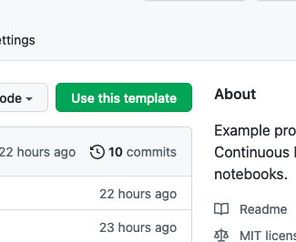

# Jupyter Notebooks Continuous Integration

Example project using nbsnapshot for Continuous Integration of Jupyter notebooks.

## Description

This repository is a template that configures GitHub Actions to test a Jupyter notebook continuously.

The notebook trains a model, and nbsnapshot checks that the distribution of the input variable does not change and that the model's performance is within an expected range.

## Using the template

Click on the "Use this template" button:

